# WMS Architecture
### 1.- Introduction
This document describes the target architecture for a **cloud-native Warehouse Management System (WMS)** deployed as a fleet of **independently operated `WMSInstance`s** (one per warehouse or region). It captures the architectural structure, key quality attribute drivers, and the major design decisions that shape how the system achieves scalability, reliability, security, and operational governance.

The scope of the views in this document is primarily **one `WMSInstance`** and its interactions with external systems (store systems, corporate financial system, and warehouse automation). Where required by constraints (e.g., shared identity and observability), the document also includes **shared platform services**, while maintaining strict **instance isolation** as a first-order architectural principle.

This architecture is produced using **Attribute-Driven Design (ADD)** and evolves iteratively. Each iteration selects a goal and drivers, refines one or more elements, instantiates concepts into views (diagrams, responsibilities, and interfaces), and records decisions. Use this document as:
- A **blueprint** for implementation teams to understand boundaries, responsibilities, and integration patterns
- A **decision log** to preserve rationale and rejected alternatives
- A **communication artifact** for stakeholders to review how the design addresses the prioritized drivers

Document organization:
- **Sections 2–6** provide context, drivers, the domain model, and container/component decomposition.
- **Section 7** provides sequence diagrams that define collaboration and transaction boundaries for key flows.
- **Section 8** summarizes key interface shapes and cross-cutting expectations (e.g., idempotency and traceability).
- **Section 9** records the design decisions per ADD iteration and their rationale.

### 2.- Context diagram
This diagram shows the system-in-context for a **single `WMSInstance`** (warehouse-scoped deployment) and its primary external interactions. The key architectural intent for Iteration 1 is to establish **instance isolation** (each warehouse instance operates independently) and **decoupled integrations** (stable APIs and/or event streams) so external systems can evolve without changing core WMS domain logic.

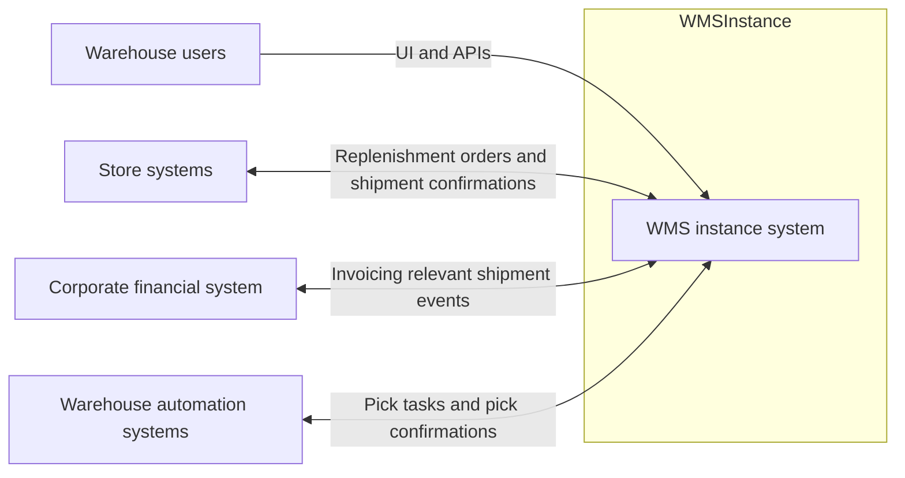

### 3.- Architectural drivers
This section summarizes the drivers relevant to the ADD iterations captured in this document.

#### Iteration drivers summary

| Iteration | Goal focus | Drivers |
|---:|---|---|
| 1 | Initial structuring of a single `WMSInstance` and its integration boundaries | **Quality**: QA-06, QA-08. **Constraints**: C-01..C-07. **Concerns**: AC-02, AC-04 |
| 2 | Foundation for inventory correctness (balances, statuses, reservations) | **Quality**: QA-04, QA-05. **User stories**: US-01, US-02, US-15. **Concerns**: AC-05 |
| 3 | High-throughput replenishment order intake and planning | **Quality**: QA-01, QA-04. **User stories**: US-03, US-04. **Concerns**: AC-01, AC-02 |
| 4 | Picking execution and automation integration | **Quality**: QA-04, QA-05, QA-06. **User stories**: US-05, US-06, US-07. **Constraints**: C-06. **Concerns**: AC-03 |
| 5 | Outbound shipping confirmations and financial integration | **Quality**: QA-04, QA-06. **User stories**: US-08, US-09, US-10. **Constraints**: C-04, C-05. **Concerns**: AC-03, AC-05 |

#### Quality attribute scenarios

| ID | Quality Attribute | Scenario summary |
| :---- | :---- | :---- |
| QA-06 | Integration | Integrations are decoupled via stable APIs and/or event streams so new systems or instances can be added without changing core WMS code. |
| QA-08 | Tenant isolation | Issues in one WMS instance must not impact other instances. |
| QA-04 | Reliability / Data integrity | Inventory-affecting actions must be processed exactly once or idempotently under retries/failures so inventory and financial data remain consistent. |
| QA-05 | Performance | Interactive inventory searches and work-queue queries must load within 1 second for 95% of requests. |

#### Constraints

| ID | Constraint |
| :---- | :---- |
| C-01 | Public cloud deployment using managed services where feasible. |
| C-02 | Multi-country compliance and full i18n/l10n (locale, currency, time zone). |
| C-03 | Independent WMS instances with possible shared services such as monitoring and identity. |
| C-04 | Integrate with store systems using standard protocols. |
| C-05 | Integrate with corporate financial system using agreed integration patterns and data contracts. |
| C-06 | Integrate with warehouse automation via resilient APIs or connectors tolerant of intermittent connectivity. |
| C-07 | Comply with corporate security and data protection policies, encryption and RBAC. |

#### Architectural concerns

| ID | Concern |
| :---- | :---- |
| AC-02 | Partition the system into modules/services to allow independent evolution while keeping complexity manageable. |
| AC-04 | Support multiple instances in the cloud with strong isolation and operational simplicity. |
| AC-03 | Design integrations with store systems, financial systems, and automation using reliable, idempotent, resilient APIs and/or event-driven mechanisms. |
| AC-05 | Ensure consistent inventory and shipment data across WMS and external systems in the presence of asynchronous messaging and failures. |

### 4.- Domain model
The following domain model represents the **core business concepts inside a single WMS instance** (i.e., one warehouse-scoped or regional deployment with independent data and lifecycle). It focuses on the objects required to support inbound, inventory, outbound fulfillment, counting/reconciliation, and traceability, as described in `Requirements/ArchitecturalDrivers.md`.

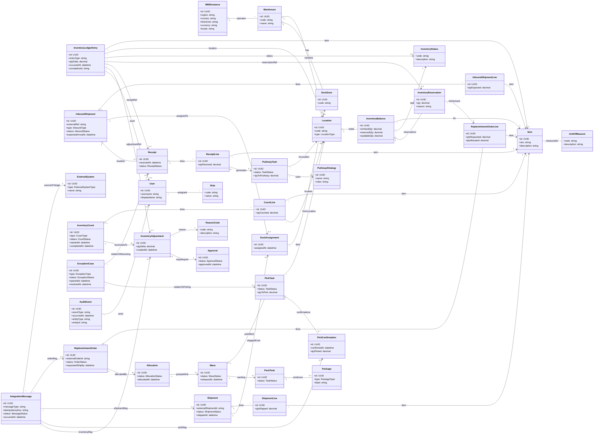

| Element | Description |
|---|---|
| `WMSInstance` | Logical deployment boundary for a single warehouse-scoped or regional WMS instance with **independent data and lifecycle**. Holds localization parameters (country, locale, currency, time zone) to support multi-country operation. |
| `Warehouse` | Physical warehouse operated by a `WMSInstance`. Owns operational layout (locations, dock doors) and is the unit of operational reporting and configuration. |
| `Location` | A typed storage/processing area (e.g., reserve, pick face, staging, receiving). Used as the anchor for inventory holding, put-away destinations, and pick sources. |
| `DockDoor` | Physical dock door used to stage inbound/outbound movements. Supports congestion control via assignments. |
| `DockAssignment` | Assignment of an inbound or outbound flow to a specific `DockDoor` at a time, supporting US-14. |
| `Item` | SKU master data required to receive, store, pick, pack, ship, count, and reconcile inventory. |
| `UnitOfMeasure` | Defines measurement units and conversions used for receiving, picking, and shipping quantities (supports US-13 configuration). |
| `InventoryStatus` | Business status of inventory (available, reserved, damaged, quarantined). Drives allocation eligibility and compliance (US-15, US-19). |
| `InventoryBalance` | Current-state view of inventory for an `Item` at a `Location` with a given `InventoryStatus`. Optimized for fast “what do we have, where” queries (QA-05). It is maintained as a projection of inventory postings. |
| `InventoryLedgerEntry` | Append-only record of an inventory-affecting posting (receipt, reservation, release, status transfer, adjustment). Supports auditability, reconciliation, and safe replay/verification (QA-04, AC-05). |
| `InventoryReservation` | A first-class reservation of inventory (often against `ReplenishmentOrderLine`) to prevent double-allocation and support idempotent processing under retries (QA-04). |
| `InboundShipment` | Represents an inbound flow (supplier delivery or return). Tracks lifecycle from expected arrival to receipt completion (US-01). |
| `InboundShipmentLine` | Line-level expectation for items/quantities in an `InboundShipment`. |
| `Receipt` | The act of receiving and registering inbound goods. Can be partial and may produce exceptions. Updates `InventoryBalance` as inventory becomes on hand (US-01, QA-04). |
| `ReceiptLine` | Received quantities by item, enabling reconciliation against shipment expectations and downstream put-away generation. |
| `PutAwayTask` | Work instruction to move received goods from receiving/staging into a target `Location` (US-02). |
| `PutAwayStrategy` | Configurable rules/heuristics used to choose put-away destinations (e.g., rotation, size), supporting warehouse-specific tailoring (US-02, US-13, AC-08). |
| `ReplenishmentOrder` | Demand submitted by store systems to replenish stores. Drives outbound planning and execution (US-03). |
| `ReplenishmentOrderLine` | Item-level demand and allocated quantity, used as the binding point for reservations and shipment contents. |
| `Allocation` | Decision artifact that allocates inventory to order lines and prepares work for release into `Wave`s (US-04). |
| `Wave` | Grouping/batching of pick work for optimization and balancing (US-04). Supports progressive release and reprioritization. |
| `PickTask` | Unit of picking work issued to humans or automation. Must be integratable and idempotent when sent to picking systems (US-05, QA-04). |
| `PickConfirmation` | Confirmation of picked quantity (manual or from automation). Updates inventory and downstream packing/shipping state (US-07). |
| `PackTask` | Work to pack picked items into handling units for shipment (US-08). |
| `Package` | A carton/pallet (handling unit) produced during packing; supports content tracking communicated to stores (US-09). |
| `Shipment` | Outbound shipment entity used to confirm shipping, communicate contents, and trigger financial events (US-08, US-09, US-10). On confirmation, the WMS commits an immutable **shipment contents snapshot** for downstream integrations and audit. |
| `ShipmentLine` | Item-level shipped quantities used for store updates and invoicing-relevant data. Acts as the canonical payload source for the shipment contents snapshot. |
| `InventoryCount` | Cycle count or full physical count activity (US-11). Drives reconciliation and adjustment workflows. |
| `CountLine` | Counted quantity per item (and optionally location), enabling discrepancy calculation. |
| `InventoryAdjustment` | Inventory delta created by reconciliation. Must be auditable and may require approval and reason codes (US-11, US-18). |
| `ReasonCode` | Controlled vocabulary explaining adjustments and exceptions for compliance and reporting (US-11, US-18). |
| `Approval` | Approval workflow state for sensitive adjustments, supporting governance and auditability (US-11, US-18). |
| `ExceptionCase` | Captures and tracks operational exceptions in receiving and picking (US-06), preventing inventory corruption and enabling resolution workflows. |
| `AuditEvent` | Immutable trace of inventory-affecting actions with actor/entity references to meet audit requirements (US-18) and support forensic troubleshooting (QA-09). |
| `User` | Human user identity inside a WMS instance context. Role assignment enables RBAC (US-13, QA-07). |
| `Role` | Role definitions used for authorization by role and warehouse (QA-07). |
| `ExternalSystem` | Represents integrated systems (store systems, financial system, picking systems) to support decoupled integrations (QA-06). |
| `IntegrationMessage` | Records integration exchanges with idempotency key and status (e.g., Pending, Sent, Acked, Failed) to support **idempotent processing**, durable delivery tracking, replay, and operational visibility (QA-04, QA-09). |

#### Inventory invariants and reservation lifecycle (Iteration 2)
- **Inventory invariants**: `availableQty = onHandQty - reservedQty` and all quantities are non-negative per `Item` + `Location` + `InventoryStatus`.
- **Reservation lifecycle**: reservations move through explicit states to support idempotency, partial processing, and safe release.

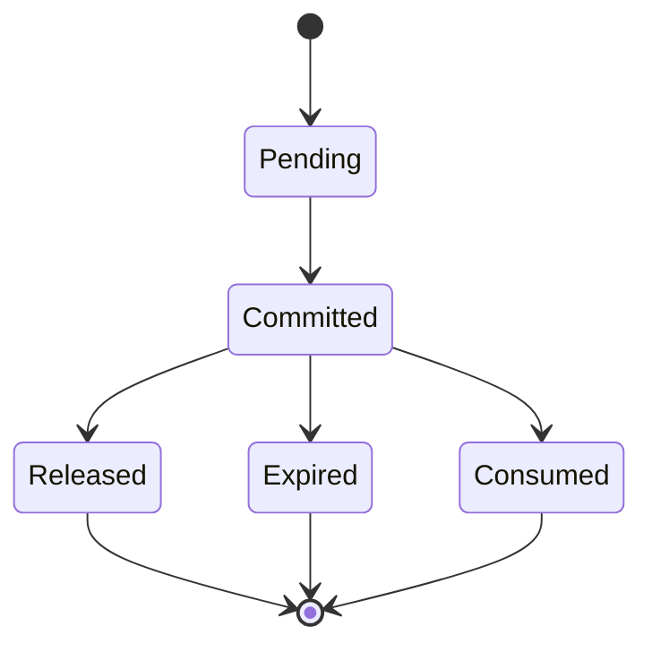

### 5.- Container diagram
This container view refines the **single `WMSInstance`** into deployable building blocks. It reflects the Iteration 1 strategy: **cell-based isolation per instance**, a **modular core** for the domain, and an **integration boundary** that supports decoupled APIs and event streams.

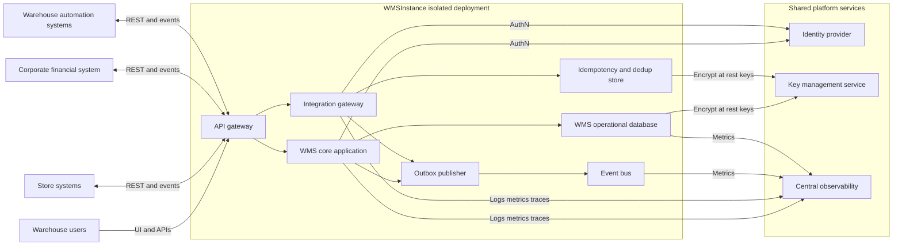

| Container | Responsibilities |
|---|---|
| `API gateway` | Stable entry point; routes traffic to the correct `WMSInstance` deployment; enforces TLS, validates short-lived identity tokens, applies coarse authorization gates and rate limits, and propagates correlation identifiers for traceability. |
| `WMS core application` | Modular monolith containing the core WMS domain and workflows for inbound, inventory, outbound, counting, tasking, configuration, approvals, and audit. Owns the source of truth for warehouse operational data and enforces policy-based authorization at command boundaries. |
| `Integration gateway` | Anti-corruption layer for store, financial, and automation systems; protocol adaptation; contract versioning; idempotency enforcement; transforms external messages into internal commands/events; enforces system-to-system authentication and maintains durable `IntegrationMessage` trace for governance. |
| `Event bus` | Managed pub/sub fabric for decoupled integrations; enables event-driven fan-out and asynchronous processing per instance. |
| `WMS operational database` | Primary per-instance datastore for core operational entities, configuration, and immutable audit trails (ledger + audit events); encrypted at rest using managed keys. |
| `Idempotency and dedup store` | Stores idempotency keys and processing outcomes for external requests/messages to prevent duplicate effects under retries/failures. |
| `Outbox publisher` | Transactional outbox publisher that reliably emits integration events from committed database changes to the event bus. |
| `Identity provider` | Centralized identity service used by all instances; provides authentication tokens and identity lifecycle. |
| `Key management service` | Managed key service used for encryption at rest and key rotation; provides auditable key usage and supports per-instance key isolation. |
| `Central observability` | Centralized logs/metrics/traces collection with strict per-instance partitioning for supportability. |

#### Disconnected operations topology (Iteration 6)
This refinement introduces a **warehouse edge node** that can continue a constrained subset of operations when WAN connectivity to the cloud is lost (QA-03). The edge records operations durably and synchronizes with the cloud `WMSInstance` after reconnect using resumable checkpoints and idempotency (QA-04, AC-03, AC-05, C-06).

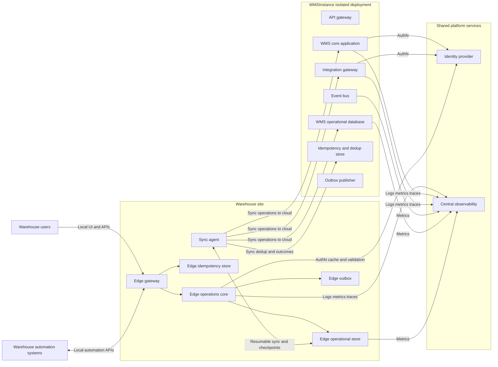

| Container | Responsibilities |
|---|---|
| `Edge gateway` | Local stable entry point for warehouse users and automation during WAN outages; enforces TLS on the local network, validates identity tokens, and routes to `Edge operations core`. |
| `Edge operations core` | Constrained subset of WMS workflows required to keep warehouse execution running during outage (e.g., pick confirmations, task progress, shipping confirmations as configured); writes a durable operational log and updates local projections. |
| `Edge operational store` | Durable local store for offline operation records, local projections, and synchronization checkpoints; supports replay and reconciliation after reconnect. |
| `Edge idempotency store` | Local idempotency/dedup outcomes for edge-facing APIs to prevent duplicate effects under retries and intermittent automation connectivity (C-06, QA-04). |
| `Edge outbox` | Transactional outbox for operations/events that must be synchronized to the cloud instance; provides durable “to be synced” intent. |
| `Sync agent` | Bi-directional store-and-forward synchronization component that resumes from checkpoints, batches operations, applies backpressure, and coordinates acknowledgements with cloud idempotency/dedup to ensure no loss and no duplicates (QA-03, QA-04). |

#### Availability, DR, observability, and progressive delivery topology (Iteration 7)
This refinement instantiates the Iteration 7 drivers by making **multi-AZ availability** and **operational control** explicit per `WMSInstance`, while keeping **shared platform services** limited to those allowed by C-03. It also introduces a **regional DR posture** aligned with QA-02 (RPO < 15 min, RTO < 4 hours) and a **progressive delivery control plane** aligned with QA-10.

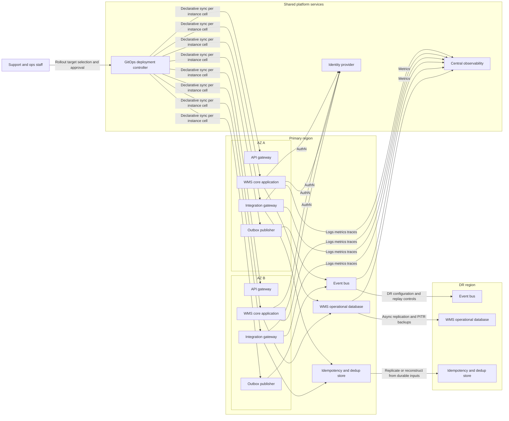

| Instantiated element | Responsibilities in Iteration 7 |
|---|---|
| `WMSInstance isolated deployment` | Treated as a **cell** spanning multiple AZs with explicit fault boundaries; can be deployed and rolled back independently of other instances (QA-08, QA-10). |
| `WMS operational database` | Configured for **multi-AZ HA**, automated backups, PITR, and **cross-region replication** to support QA-02 DR targets. |
| `Event bus` | Operated as a managed service with multi-AZ durability and DR posture; supports operational controls such as replay and retention for recovery. |
| `Central observability` | Enforces **per-instance partitioning** and provides fleet dashboards and alerts for core flows and integrations (QA-09, AC-07, C-03). |
| `GitOps deployment controller` | Provides declarative, auditable rollouts with **per-instance targeting** and promotion gates for progressive delivery (QA-10). |

### 6.- Component diagrams
The following component view refines the `WMS core application` into **bounded modules**. These are logical components intended to minimize coupling and enable future extraction if needed.

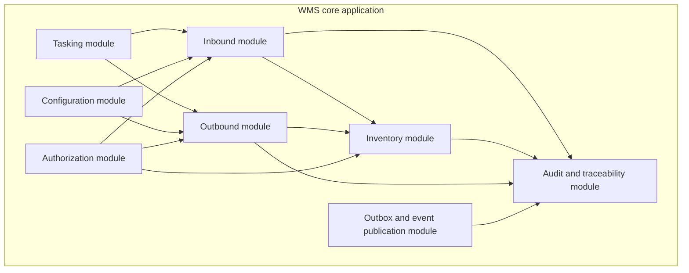

| Component | Responsibilities |
|---|---|
| `Inbound module` | Inbound shipment and receiving lifecycle; receipts; put-away task creation; exception capture for inbound. |
| `Inventory module` | Inventory balances, statuses, reservations, adjustments, and inventory-affecting invariants. |
| `Outbound module` | Replenishment orders and their lifecycle; order intake validation and normalization; allocation and wave planning; planning work partitioning; shipment lifecycle and contents. |
| `Tasking module` | Work orchestration for put-away, picking, packing tasks; work queue queries; task assignment scaffolding. |
| `Configuration module` | Warehouse-specific configuration such as locations, units of measure, strategies, and integrations configuration. |
| `Audit and traceability module` | Immutable audit events for inventory-affecting actions and integration processing trace. |
| `Authorization module` | Role-based authorization checks scoped to warehouse instance and roles. |
| `Outbox and event publication module` | Transactional outbox writes and publication coordination for domain and integration events. |

### 7.- Sequence diagrams
The sequence diagrams below illustrate the key interactions across iterations. Iteration 1 focuses on **decoupled integration** (QA-06) and **per-instance isolation boundaries** (QA-08). Iteration 2 refines the **inventory correctness** foundation (QA-04, AC-05) while maintaining fast operational reads (QA-05).

#### Sequence 1: Store submits replenishment order
This sequence shows a store system submitting an order through a stable API with idempotency. The integration gateway translates the request into an internal command, commits it, and emits an event via the outbox.

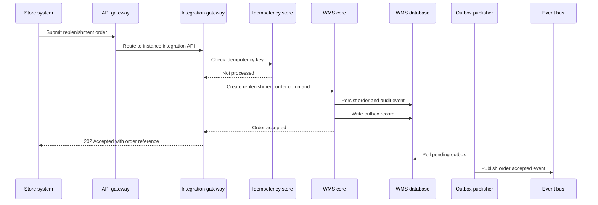

#### Sequence 2: Automation confirms picks
This sequence shows an automation system confirming picks with **inbox-first durability** and idempotency to avoid duplicate inventory updates under retries and intermittent connectivity.

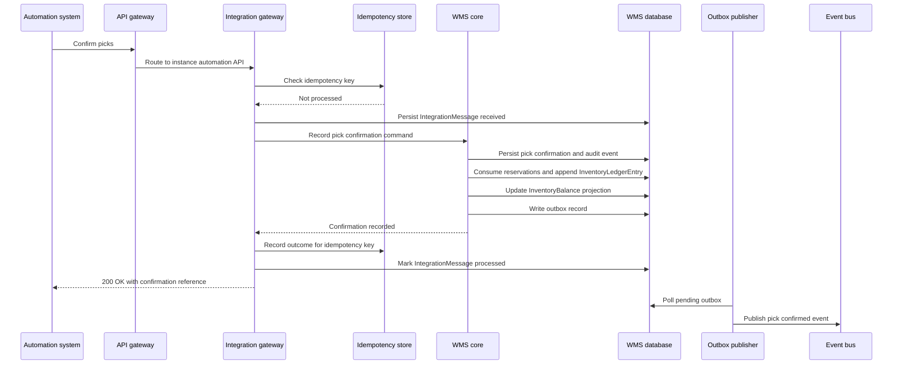


#### Sequence 3: Shipment confirmation triggers downstream notifications
This sequence shows shipment confirmation being committed once (idempotent) and producing downstream notifications to store and financial systems via the integration boundary, with durable delivery tracking.

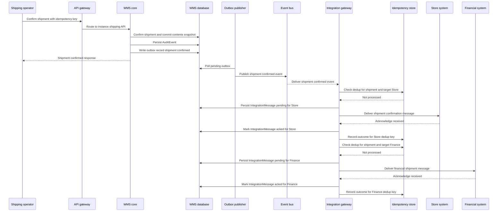

#### Sequence 4: Receiving posts inventory with auditable ledger entry (Iteration 2)
This sequence shows receiving as a single inventory-affecting transaction: the receipt is persisted together with an `InventoryLedgerEntry`, the `InventoryBalance` projection is updated, and an `AuditEvent` is recorded.

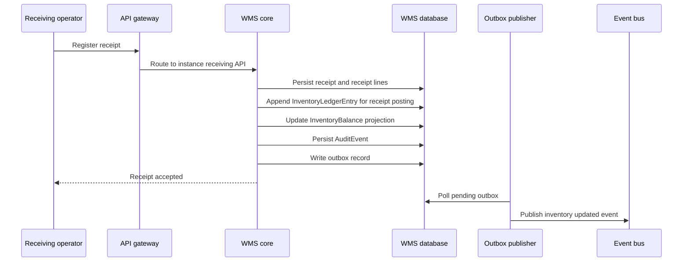

#### Sequence 5: Create reservation to prevent double allocation (Iteration 2)
This sequence shows an internal reservation created against demand. The inventory module enforces invariants and records a ledger entry so retries are safe and auditable.

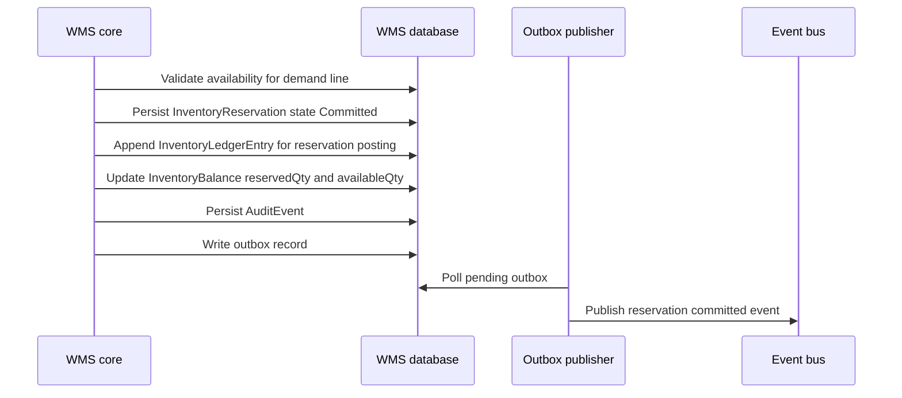

#### Sequence 6: Inventory status transfer (available to quarantined) (Iteration 2)
This sequence shows a status change as a posting that preserves auditability and inventory correctness.

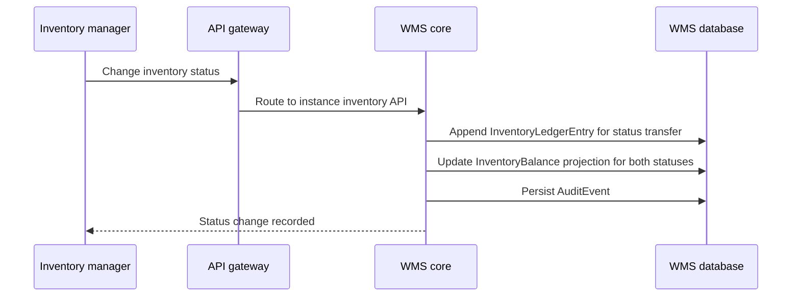

#### Sequence 7: Async order intake with durable acceptance and planning trigger (Iteration 3)
This sequence refines replenishment order intake to support peak throughput by durably accepting requests (idempotent) and triggering downstream planning asynchronously via the outbox and event bus.

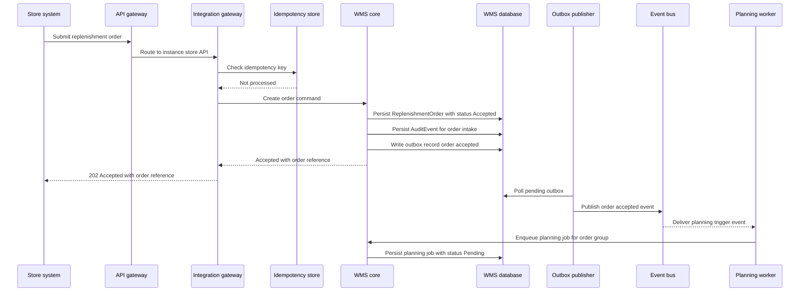

#### Sequence 8: Allocation and wave planning with reservation-based correctness (Iteration 3)
This sequence shows planning consuming a planning job, allocating inventory by committing reservations (inventory invariants), building a wave, and generating pick tasks while emitting durable events via the outbox.

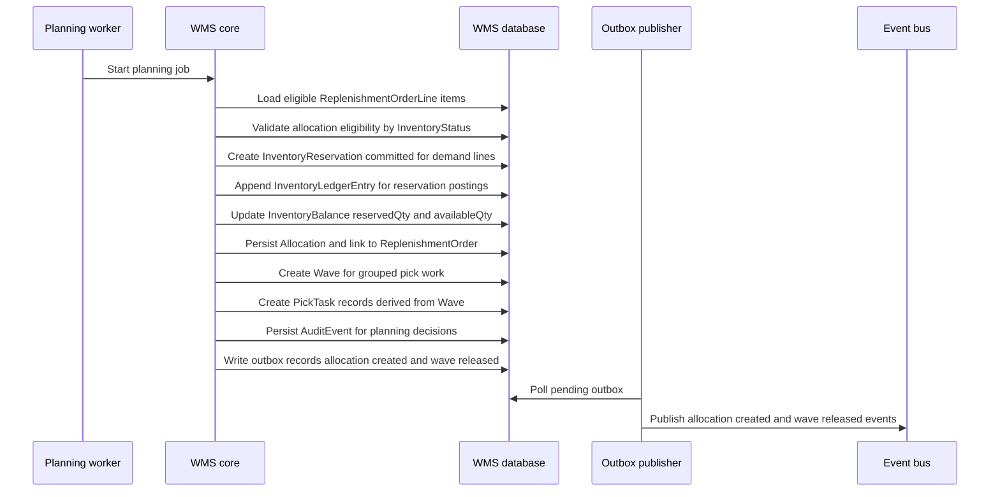

#### Sequence 9: Distribute pick tasks to automation with store and forward (Iteration 4)
This sequence shows pick task distribution using a store-and-forward connector in the integration boundary so intermittent automation connectivity does not block warehouse execution.

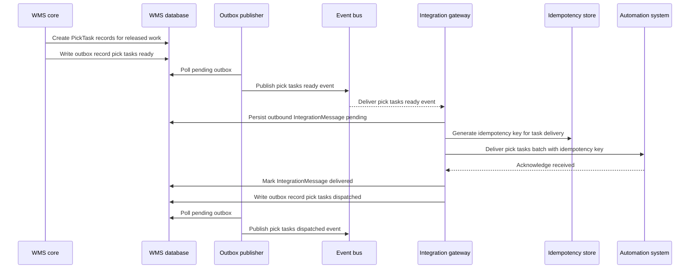

#### Sequence 10: Manual picker confirms picks (Iteration 4)
This sequence shows a picker confirming picks via the WMS UI/API, with inventory postings handled at the inventory boundary for correctness and auditability.

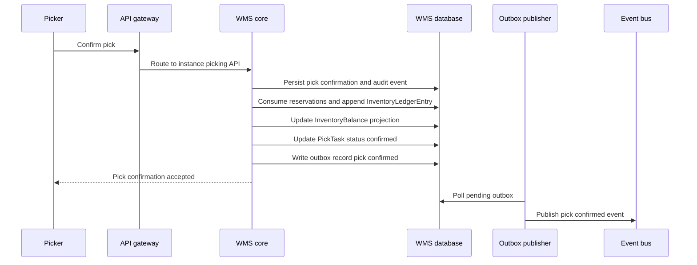

#### Sequence 11: Register and resolve a picking exception (Iteration 4)
This sequence shows a supervisor capturing a picking exception and resolving it with controlled, auditable actions so operations continue without corrupting inventory.

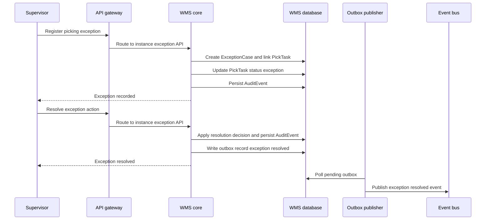

#### Sequence 12: Retrying outbound store and finance deliveries (Iteration 5)
This sequence illustrates the operational behavior for asynchronous delivery when an external target is temporarily unavailable: deliveries are retried from durable state without duplicating effects.

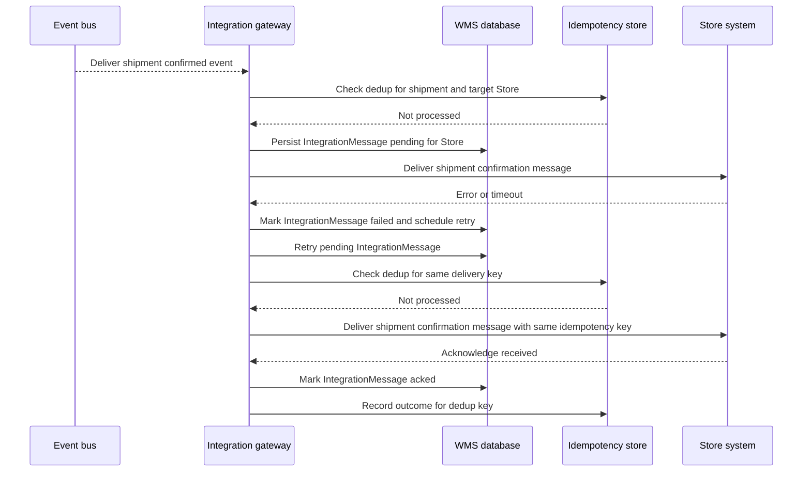

#### Sequence 13: Offline pick confirmation recorded at the edge (Iteration 6)
This sequence shows a pick confirmation being recorded locally during a WAN outage with **durable logging** and **idempotency**, then synchronized to the cloud instance after reconnect without duplicate inventory effects (QA-03, QA-04).

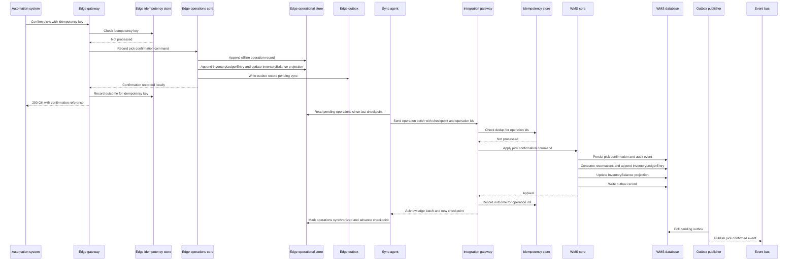

#### Sequence 14: Reconnect synchronization completes with resumable checkpoints (Iteration 6)
This sequence shows the sync agent resuming from a known checkpoint after reconnect, applying backpressure and batching so synchronization completes quickly while preserving idempotency and traceability (QA-03, QA-04).

```mermaid
sequenceDiagram
  participant Sync as Sync agent
  participant EdgeDB as Edge operational store
  participant Int as Integration gateway
  participant Idem as Idempotency store
  participant Core as WMS core
  participant DB as WMS database

  Sync->>EdgeDB: Load last acknowledged checkpoint
  loop Until edge backlog is empty
    Sync->>EdgeDB: Read next batch of operations
    Sync->>Int: Submit batch with checkpoint and operation ids
    Int->>Idem: Dedup check for batch
    Idem-->>Int: Not processed or partially processed
    Int->>Core: Apply operations idempotently
    Core->>DB: Commit resulting state and outbox
    Int-->>Sync: Ack applied operations and next checkpoint
    Sync->>EdgeDB: Mark applied and persist next checkpoint
  end
```

#### Sequence 15: Progressive delivery rollout to a subset of instances (Iteration 7)
This sequence shows a safe rollout of a new version to a selected subset of instances, using promotion gates backed by centralized observability signals (QA-10, QA-09).

```mermaid
sequenceDiagram
  participant Ops as Support and ops staff
  participant GitOps as GitOps deployment controller
  participant InstA as WMSInstance A
  participant InstB as WMSInstance B
  participant Obs as Central observability

  Ops->>GitOps: Select target instances for rollout
  GitOps->>InstA: Apply release manifest
  InstA-->>Obs: Emit health and SLI signals
  Obs-->>GitOps: Canary evaluation result

  alt Canary fails
    GitOps->>InstA: Roll back to previous manifest
    InstA-->>Obs: Emit recovery signals
  else Canary succeeds
    GitOps->>InstB: Apply release manifest
    InstB-->>Obs: Emit health and SLI signals
    Obs-->>GitOps: Promotion evaluation result
    GitOps-->>Ops: Rollout complete
  end
```

#### Sequence 16: Regional disaster failover for a single instance (Iteration 7)
This sequence shows a controlled failover of one `WMSInstance` to the DR region, targeting QA-02 RPO/RTO while preserving instance isolation (QA-08).

```mermaid
sequenceDiagram
  participant Ops as Support and ops staff
  participant Orchestrator as DR orchestrator
  participant DNS as Routing and DNS
  participant DBP as Primary region database
  participant DBD as DR region database
  participant BusD as DR event bus
  participant InstD as WMSInstance in DR

  Ops->>Orchestrator: Declare incident and start failover
  Orchestrator->>DBD: Promote replica and enable writes
  DBP-->>DBD: Replication catches up to last point
  Orchestrator->>BusD: Ensure integration streams and replay controls
  Orchestrator->>InstD: Start instance workloads in DR
  Orchestrator->>DNS: Switch routing to DR instance endpoints
  InstD-->>Ops: Instance available in DR
```


#### Sequence 17: Cycle count reconciliation with approvals and auditable postings (Iteration 8)
This sequence shows a cycle count leading to an adjustment with reason code and optional approval, posted through the inventory ledger with immutable audit events (US-11, US-18, QA-04, QA-07).

```mermaid
sequenceDiagram
  participant User as Inventory manager
  participant Approver as Supervisor
  participant GW as API gateway
  participant Core as WMS core
  participant Sec as Authorization module
  participant DB as WMS database
  participant Out as Outbox publisher
  participant Bus as Event bus

  User->>GW: Start cycle count
  GW->>Core: Route to instance counting API
  Core->>Sec: Authorize StartCount scoped to instance and warehouse
  Sec-->>Core: Allowed
  Core->>DB: Create InventoryCount status InProgress
  Core->>DB: Persist AuditEvent
  Core-->>User: Count created

  User->>GW: Submit count lines
  GW->>Core: Record count lines
  Core->>Sec: Authorize RecordCount
  Sec-->>Core: Allowed
  Core->>DB: Persist CountLine entries
  Core->>DB: Persist AuditEvent
  Core-->>User: Lines recorded

  Core->>DB: Compute discrepancies and draft InventoryAdjustment with ReasonCode
  alt Adjustment requires approval
    Core->>DB: Create Approval status Pending
    Core->>DB: Persist AuditEvent
    Core-->>User: Adjustment pending approval

    Approver->>GW: Approve adjustment
    GW->>Core: Route to approval API
    Core->>Sec: Authorize ApproveAdjustment
    Sec-->>Core: Allowed
    Core->>DB: Mark Approval Approved
    Core->>DB: Append InventoryLedgerEntry for adjustment posting
    Core->>DB: Update InventoryBalance projection
    Core->>DB: Persist AuditEvent
    Core->>DB: Write outbox record inventory adjusted
    Core-->>Approver: Approved and posted
  else No approval required
    Core->>DB: Append InventoryLedgerEntry for adjustment posting
    Core->>DB: Update InventoryBalance projection
    Core->>DB: Persist AuditEvent
    Core->>DB: Write outbox record inventory adjusted
    Core-->>User: Adjustment posted
  end

  Out->>DB: Poll pending outbox
  Out->>Bus: Publish inventory adjusted event
```

#### Sequence 18: Warehouse configuration and role changes with audit trail (Iteration 8)
This sequence shows warehouse-specific configuration or role assignment updates being authorized, versioned, and audited for governance (US-13, QA-07, C-07, AC-08).

```mermaid
sequenceDiagram
  participant User as Operations manager
  participant GW as API gateway
  participant Core as WMS core
  participant Sec as Authorization module
  participant DB as WMS database
  participant Out as Outbox publisher
  participant Bus as Event bus

  User->>GW: Update configuration or role assignment
  GW->>Core: Route to instance configuration API
  Core->>Sec: Authorize ConfigChange or RoleAdmin
  Sec-->>Core: Allowed
  Core->>DB: Persist configuration change with version and effective scope
  Core->>DB: Persist AuditEvent
  Core->>DB: Write outbox record config changed
  Core-->>User: Change accepted

  Out->>DB: Poll pending outbox
  Out->>Bus: Publish config changed event
```

#### Sequence 19: Recall blocking prevents allocation and shipment (Iteration 8)
This sequence shows a recall or return control action blocking inventory via status governance so planning and execution cannot allocate or ship non-eligible stock (US-19, QA-04, QA-07).

```mermaid
sequenceDiagram
  participant User as Inventory manager
  participant GW as API gateway
  participant Core as WMS core
  participant Sec as Authorization module
  participant DB as WMS database
  participant Plan as Planning worker

  User->>GW: Block inventory for recall
  GW->>Core: Route to instance inventory API
  Core->>Sec: Authorize StatusChange or RecallControl
  Sec-->>Core: Allowed
  Core->>DB: Append InventoryLedgerEntry for status transfer to quarantined
  Core->>DB: Update InventoryBalance projection
  Core->>DB: Persist AuditEvent
  Core-->>User: Recall block recorded

  Plan->>Core: Allocate inventory for outbound demand
  Core->>DB: Validate allocation eligibility by InventoryStatus
  alt Eligible stock exists
    Core->>DB: Commit InventoryReservation and ledger postings
    Core->>DB: Persist AuditEvent
    Plan-->>Core: Allocation succeeded
  else Only blocked stock available
    Core->>DB: Persist AuditEvent allocation blocked by status
    Plan-->>Core: Allocation rejected
  end
```

### 8.- Interfaces
This section lists the primary interface shapes established in Iteration 1. Detailed contracts and schemas will be refined in later iterations.

| Interface | Type | Notes |
|---|---|---|
| Store integration API | REST and events | Inbound: versioned endpoints for replenishment orders with idempotency keys required; order intake is durably accepted (202) and planned asynchronously in Iteration 3. Outbound: shipment confirmation messages emitted as versioned events and delivered with durable `IntegrationMessage` tracking and idempotent delivery semantics (Iteration 5). |
| Automation integration API | REST | Versioned endpoints for pick task distribution and pick confirmations; supports intermittent connectivity via retries and idempotency; requires correlation identifiers (`pickTaskId`, `correlationId`) and idempotency keys for confirmations and task delivery acknowledgements. |
| Financial integration | Events and REST | Primary path is event-driven with stable contracts. Shipment financial messages are emitted from confirmed shipment state (outbox) and delivered with durable `IntegrationMessage` tracking and idempotent delivery semantics (Iteration 5). Synchronous calls may be used for validation or acknowledgements per corporate patterns. |
| Shipping operational API | REST | Confirm shipment endpoint for warehouse users. Requires an idempotency key so retries or double-submits return the same outcome without duplicating shipment confirmation or downstream messages (Iteration 5). |
| Instance routing | HTTP | Each request is routed to a specific `WMSInstance` deployment using an instance identifier and authorization scope. |
| Inventory operational API | REST | Inventory queries and inventory-affecting commands (receive, reserve, release, status change, adjust). Inventory-affecting commands must be idempotent (QA-04). |
| Edge operational API | REST | Local-only operational API exposed by the warehouse edge node for offline-safe commands and queries. Requires idempotency keys and stable correlation identifiers; designed for intermittent warehouse connectivity (QA-03, QA-04, C-06). |
| Edge synchronization interface | HTTPS | Bi-directional, resumable synchronization between `Sync agent` and cloud `WMSInstance` components using mutual TLS, checkpoints, batching, and deduplication of operation ids to ensure no loss and no duplicates during reconnect (QA-03, QA-04, AC-03, AC-05). |
| Observability telemetry | OTLP and vendor APIs | Standardized logs, metrics, and traces emitted with required dimensions such as `instanceId`, `correlationId`, and `integrationTarget` to support fleet troubleshooting and SLO alerting (QA-09, AC-07). |
| Release management control | GitOps and cluster APIs | Declarative per-instance rollout targeting, promotion gates, and rollback for progressive delivery (QA-10). |
| DR orchestration | Automation APIs | Interfaces used to promote replicas, restore dependencies, and switch routing per instance to meet QA-02 RPO/RTO goals. |

### 9.- Design decisions
The following design decisions were made during the ADD iterations to satisfy the selected drivers.

|Driver|Decision|Rationale|Discarded alternatives|
|---|---|---|---|
|AC-04, QA-08, C-03|Adopt a **cell-based instance model** where each `WMSInstance` is an isolated deployment unit with its own primary datastore and eventing resources; requests are routed to the correct instance at the edge.|Strong fault and performance isolation reduces blast radius and prevents noisy-neighbor effects; enables independent lifecycle management per warehouse instance while still allowing selective shared platform services.|Shared multi-tenant runtime and shared database with tenant partitioning (lower baseline cost but weaker isolation and higher operational and data-leakage risk).|
|AC-02|Implement the core WMS as a **modular monolith** for Iteration 1, with bounded modules for inbound, inventory, outbound, tasking, configuration, audit, and authorization.|Establishes clear internal boundaries without premature distributed-systems complexity; supports a walking skeleton quickly while keeping the design evolvable.|Microservices from day one (better independent scaling but significantly higher complexity, latency, and operational burden early).|
|QA-06, C-04, C-05, C-06|Introduce an **Integration gateway** as an anti-corruption layer for store, financial, and automation systems; centralize protocol adaptation and contract versioning outside the domain core.|Decouples external system variability from the core domain; supports adding new systems or changing protocols without changing core modules; improves maintainability and reduces integration-induced coupling.|Embedding adapters and protocol logic directly inside domain modules (faster initially but brittle and hard to evolve across many integrations).|
|QA-06, C-01|Use a **managed event bus** for asynchronous integration flows and fan-out, complemented by synchronous REST APIs where needed.|Enables stable event streams and loose coupling; supports asynchronous workflows and future extensibility while leveraging managed services to reduce ops burden.|Purely synchronous point-to-point REST for all integrations (tighter coupling and lower resilience to spikes and downtime).|
|QA-06|Adopt **transactional outbox** in the per-instance database with an **outbox publisher** to publish events to the event bus.|Avoids dual-write inconsistencies; ensures events correspond to committed state changes; provides a reliable foundation for decoupled integration messaging.|Direct publish to the event bus inside request processing without outbox (risk of lost or duplicated events under failures).|
|C-06, QA-06|Enforce **idempotency and deduplication** at the integration boundary using idempotency keys and a dedup store per instance.|Warehouse and automation connectivity can be intermittent; idempotency prevents duplicate effects under retries and supports safe replays of integration calls/messages.|Best-effort retries without idempotency (risk of duplicate downstream effects and operational instability).|
|C-07, QA-08|Centralize authentication via a shared **identity provider** while keeping authorization checks **instance-scoped** in the core and integration gateway.|Balances operational simplicity with strict instance isolation: authentication is shared, but access decisions remain bounded by warehouse instance context.|Separate identity per instance (maximum isolation but high operational overhead and inconsistent user experience).|
|C-03|Centralize observability in a shared platform with **strict per-instance partitioning** for logs, metrics, and traces.|Supports fleet operations and troubleshooting at scale while respecting instance isolation requirements.|Per-instance observability stacks (strong isolation but higher cost and fragmented operations).|
|QA-04, AC-05, US-01, US-02|Adopt an **append-only inventory ledger** (`InventoryLedgerEntry`) as the source of audit truth for all inventory-affecting postings, with `InventoryBalance` maintained as a current-state projection for operational reads.|Provides a consistent, auditable trail for inventory changes and enables verification/replay to detect and correct inconsistencies (**QA-04**, **AC-05**) while preserving fast interactive queries (**QA-05**).|Only persisting mutable `InventoryBalance` rows (simpler but weak auditability and harder to reconcile inconsistencies after failures).|
|QA-04, AC-05, US-15|Make **inventory invariants explicit** at the inventory boundary (e.g., `availableQty = onHandQty - reservedQty`, non-negative quantities per `Item` + `Location` + `InventoryStatus`) and enforce them as part of inventory postings.|Reduces risk of double allocation and inconsistent availability calculations; concentrates correctness rules where inventory changes occur (**QA-04**) and supports cross-system consistency reasoning (**AC-05**).|Embedding availability/reservation logic across multiple modules (higher inconsistency risk and harder auditability).|
|QA-04, AC-05, US-15|Model `InventoryReservation` as a **first-class state machine** (Pending → Committed → Consumed/Released/Expired) and record reservation postings in the ledger.|Supports idempotent retries, partial processing, and safe release/expiry semantics; provides traceability for reservation-driven availability changes (**QA-04**, **AC-05**).|Implicit reservations by decrementing `availableQty` only (harder to audit, brittle under retries/partials).|
|QA-04, QA-05|Require **idempotency for inventory-affecting commands** on the `Inventory operational API` (receipt posting, reserve/release, status change, adjustment), with outcomes recorded for safe retries.|Prevents duplicate effects under intermittent connectivity and retries (**QA-04**) while enabling predictable client behavior and operational recovery without manual reconciliation; keeps interactive flows responsive by avoiding heavyweight locking (**QA-05**).|Best-effort retries without idempotency (duplicate postings and inventory corruption risk).|
|QA-01, AC-01, US-03|Adopt an **async order intake** model: durably accept replenishment orders (202) after persistence, then trigger downstream planning asynchronously via outbox/event bus.|Decouples peak API traffic from planning compute to sustain **10,000 orders/hour** without downtime (**QA-01**), while preserving durability and recoverability of accepted demand.|Synchronous “submit and allocate” in the API path (higher tail latency and overload risk at peak).|
|QA-01, AC-02, US-04|Partition outbound planning into **Order Intake** (validation/normalization) and **Planning** (allocation/wave building) responsibilities within the `Outbound module` and execute planning via horizontally-scalable workers.|Improves modularity and scalability at the hotspot without introducing distributed-service complexity; planning throughput can scale independently from ingestion, supporting **QA-01** and keeping boundaries manageable (**AC-02**).|Single monolithic outbound workflow component for both ingestion and planning (harder to scale and evolve).|
|QA-04, US-04|Make **reservation-based allocation** the correctness boundary during planning: allocation commits `InventoryReservation` and related ledger/balance updates atomically with allocation artifacts.|Prevents double allocation under concurrent planning/retries; leverages inventory invariants and auditability foundation from Iteration 2 to preserve **QA-04** during high-throughput allocation.|Allocating by directly decrementing availability in outbound tables without inventory postings (inconsistent source of truth and weaker auditability).|
|QA-04, QA-01, US-04|Emit `allocation created` and `wave released` as **transactional outbox events** tied to committed planning state.|Ensures downstream systems and workers see only committed planning outcomes (**QA-04**) while enabling asynchronous fan-out and scaling (**QA-01**).|Direct bus publish inside planning transaction without outbox (risk of lost/duplicated events).|
|QA-04, QA-06, C-06, AC-03, US-05|Adopt a **store-and-forward automation connector** at the integration boundary: persist outbound pick task messages and manage delivery with retries/backoff and acknowledgements.|Tolerates intermittent warehouse automation connectivity (**C-06**) while keeping integrations decoupled (**QA-06**) and preventing lost/duplicated task dispatch effects under retries (**QA-04**); isolates protocol/vendor variability (**AC-03**).|Pure synchronous “push tasks” from core to automation (tight coupling, fragile under connectivity issues); direct point-to-point calls without durable send state (hard to recover).|
|QA-04, QA-06, AC-03, US-07|Require **idempotent pick confirmations** from automation (and manual confirmation APIs) using idempotency keys and recorded outcomes, with stable correlation identifiers (`pickTaskId`, `correlationId`).|Prevents duplicate inventory postings and duplicated confirmations under retries (**QA-04**); improves reconciliation and traceability across systems (**QA-06**, **AC-03**).|Attempting exactly-once delivery “over the wire” (unrealistic); best-effort retries without dedup (inventory corruption risk).|
|QA-04, AC-05, US-07|Handle pick confirmations by **posting through the Inventory module boundary** (consume reservations, append `InventoryLedgerEntry`, update `InventoryBalance` projection) as a single correctness boundary.|Reuses the inventory correctness foundation to ensure picks consistently affect inventory with auditability and replayability (**QA-04**, **AC-05**), regardless of source (automation or manual).|Updating inventory directly in tasking/integration code paths (leaks invariants and increases inconsistency risk).|
|US-06, QA-04|Treat picking exceptions as **first-class workflow** (`ExceptionCase`) with controlled resolution actions and audit events, tied to `PickTask` state transitions.|Keeps operations running while preventing ad-hoc inventory changes; provides auditable, supervised resolution that preserves correctness under disruptions (**US-06**, **QA-04**).|Manual out-of-band fixes and spreadsheet reconciliation (fast locally but high integrity/compliance risk); burying exceptions in logs only (poor operational control).|
|QA-04, AC-05, US-08|Treat **shipment confirmation** as the single atomic correctness boundary: confirm shipment, commit an immutable contents snapshot, persist `AuditEvent`, and write outbox records in one transaction.|Prevents partial “confirmed but not publishable” states and eliminates dual-write gaps; provides a deterministic source for downstream store confirmations and financial events while preserving auditability (**QA-04**, **AC-05**).|Multi-step confirmation flow with separate publish calls (higher inconsistency risk); direct publish without outbox inside confirmation path (lost/duplicate event risk).|
|QA-06, C-04, C-05, AC-03, US-09, US-10|Deliver store confirmations and financial shipment events through the **Integration gateway** consuming the event bus, with anti-corruption mapping per target system.|Centralizes protocol adaptation and contract governance at the boundary; keeps the core domain stable while meeting external integration requirements (**QA-06**, **C-04**, **C-05**) and strengthening integration resilience (**AC-03**).|Embedding store/finance adapters inside core outbound logic (tighter coupling); direct point-to-point core calls to external systems (lower resilience, harder evolution).|
|QA-04, AC-03, US-09, US-10|Use `IntegrationMessage` as a durable delivery record for outbound store/finance deliveries with explicit state transitions and replay controls.|Provides traceability and operational control for retries/backoff and recovery; supports safe reprocessing without duplicating downstream effects (**QA-04**) and improves integration operability (**AC-03**).|Fire-and-forget publishing with no delivery state (poor recovery); relying on logs only (high operational risk).|
|QA-04, AC-03, US-08, US-09, US-10|Enforce **idempotency/dedup** for shipment confirmation and per-target outbound deliveries using idempotency keys and recorded outcomes in the idempotency store.|Ensures retries (UI double-submit, transient failures, replays) do not create duplicate confirmations or financial postings; provides “same request, same outcome” semantics across boundaries (**QA-04**, **AC-03**).|Attempting exactly-once delivery “over the wire” (unrealistic); best-effort retries without dedup (duplicate store confirmations/invoices risk).|
|QA-03, QA-04, C-06, AC-03, AC-05|Introduce a **warehouse edge node** (`Edge gateway`, `Edge operations core`) to support **disconnected operations** with local APIs for users and automation, and later synchronization to the cloud instance.|Meets the requirement to continue operations for up to **3 hours** during WAN outage with controlled scope, while maintaining integration resilience and consistency reasoning across boundaries (**QA-03**, **QA-04**, **AC-03**, **AC-05**).|Cloud-only operation (cannot meet QA-03); offline capability implemented independently in each handheld/client (high inconsistency and governance risk).|
|QA-03, QA-04, AC-05|Adopt a durable **edge operational store** with an **append-only offline operation record** and local projections (ledger/balance), enabling replay and verification during reconciliation.|Ensures **zero data loss** and provides a deterministic basis for reconciliation and audit across disconnect/reconnect cycles; aligns with the existing ledger-based correctness approach (**QA-04**, **AC-05**) while meeting offline continuity (**QA-03**).|Snapshot-only synchronization without operation journal (hard to prove completeness/no duplicates); multi-master database replication (high conflict risk for inventory semantics).|
|QA-03, QA-04, AC-03, AC-05|Introduce a **Sync agent** using **resumable checkpoints** and batched submissions of operation ids to cloud components with deduplication and acknowledgements.|Enables predictable catch-up within the recovery window (targeting the “sync within 30 minutes” requirement) and prevents duplicate effects during reconnect storms via checkpointing and idempotency (**QA-03**, **QA-04**).|Manual export/import reconciliation (slow and error-prone); “best-effort” replay without checkpoints (risk of gaps/duplicates).|
|QA-04, C-06|Require **idempotency keys** for the `Edge operational API` and maintain outcomes in an **Edge idempotency store** for edge-facing operations and automation connectivity retries.|Prevents duplicate local effects under intermittent automation connectivity and retried client requests, preserving inventory integrity during outages (**QA-04**, **C-06**).|Relying on exactly-once transport guarantees (unrealistic across heterogeneous warehouse systems); retries without recorded outcomes (duplicate postings risk).|
|QA-03, QA-04, AC-03|Define an explicit **Edge synchronization interface** (mutual TLS, checkpoints, batching, dedup of operation ids) between the edge and the cloud instance integration boundary.|Makes the reconnect contract explicit and secure, and ensures synchronization is resumable and idempotent to meet “no loss, no duplicates” objectives (**QA-03**, **QA-04**) while preserving integration boundary principles (**AC-03**).|Ad-hoc database access from edge to cloud DB (security/operational risk); per-operation point-to-point sync without batching/backpressure (poor recovery performance).|
|QA-02, QA-08, AC-04, C-03|Run each `WMSInstance` cell as a **multi-AZ deployment** with AZ-spread stateless workloads and explicit readiness and health signaling.|Survives loss of a node or an AZ without interrupting core warehouse operations (**QA-02**) while keeping failures and noisy-neighbor effects isolated to the instance cell (**QA-08**, **AC-04**, **C-03**).|Single-AZ instance deployments (lower cost but fails QA-02); shared multi-tenant runtime spanning many instances (higher cascade risk).|
|QA-02, C-01, QA-08|Adopt a **managed HA operational database per instance** with automated backups, PITR, and **cross-region replication** to a DR region.|Leverages managed services to reduce ops overhead (**C-01**) while meeting availability and DR objectives (**QA-02**) without coupling multiple instances to a shared datastore (**QA-08**).|Self-managed database on VMs (higher ops burden); backup-only DR without replication (often misses RTO); shared database with tenant partitioning (weaker isolation).|
|QA-10, QA-08, C-03|Use a **GitOps-based progressive delivery control plane** to target subsets of instances, gate promotions, and enable rapid rollback.|Enables safe change across a fleet: selected-instance rollouts and quick rollback reduce release risk and avoid cross-instance downtime (**QA-10**) while keeping instance cells independent (**QA-08**) and sharing only the control plane (**C-03**).|Manual per-instance deployments (error-prone); big-bang fleet upgrades (high risk); rolling updates without gates (harder rollback safety).|
|QA-02, QA-08|Define **per-instance DR failover procedures** (replica promotion, dependency restoration, routing switch) as an orchestrated, repeatable runbook.|Achieves predictable recovery within RTO/RPO targets (**QA-02**) while allowing failover to be executed for a single affected instance without impacting others (**QA-08**).|Ad-hoc manual failover (slow, error-prone); always-on active-active multi-region for all instances (complex, expensive, harder correctness).|
|QA-09, AC-07, C-03|Standardize **end-to-end observability telemetry** with required dimensions (`instanceId`, `correlationId`, `integrationTarget`) and central aggregation with per-instance partitioning.|Improves MTTR and operational clarity for order/integration flows (**QA-09**, **AC-07**) while enabling shared tooling without violating instance isolation (**C-03**).|Logs-only troubleshooting (slow); per-instance isolated observability stacks (fragmented and costly).|
|QA-07, C-07, AC-06|Centralize authentication in a shared IdP using OIDC/OAuth2 with short-lived tokens, and enforce **instance-scoped authorization** (role and warehouse scope) in the `Authorization module` and at the `API gateway` boundary.|Provides strong AuthN while ensuring access decisions remain within the instance isolation boundary; supports least-privilege access and reduces risk of cross-warehouse access (**QA-07**, **AC-06**, **C-07**).|Per-instance identity stores (high ops overhead and inconsistent governance); long-lived API keys only (weak governance and rotation risk).|
|QA-07, C-07|Adopt **defense-in-depth** ingress security: TLS everywhere, token validation at `API gateway`, coarse authorization gates, and propagation of correlation identifiers for traceability.|Reduces attack surface, blocks unauthenticated/unauthorized access early, and ensures audit/trace correlation for sensitive inventory operations (**QA-07**, **US-18**).|Application-only enforcement with a pass-through gateway (inconsistent controls and larger blast radius).|
|QA-07, C-07|Encrypt sensitive operational data at rest using a managed **key management service** with auditable key use and rotation, applied to per-instance `WMS operational database` and `Idempotency and dedup store`.|Meets corporate security policy expectations and provides clear, auditable controls for encryption-at-rest while preserving per-instance isolation via scoped key policies (**QA-07**, **C-07**).|Single shared encryption key for all instances (weak isolation); application-managed keys (high operational risk).|
|US-18, QA-04, QA-07|Strengthen auditability by recording all inventory-affecting operations as immutable `InventoryLedgerEntry` plus `AuditEvent`, and ensure audit/event publication uses the transactional outbox to avoid gaps.|Creates a tamper-resistant and replayable trail for audits and investigations while preventing “state changed but missing audit/event” failure modes (**US-18**, **QA-04**, **QA-07**).|Relying only on mutable audit columns on business tables (weak forensic integrity); relying on centralized logs only (retention and authority limitations).|
|US-11, US-18, QA-04|Model inventory counting and reconciliation as explicit workflow state: `InventoryCount`, `InventoryAdjustment`, `ReasonCode`, and `Approval`, with posting gated by authorization and approval rules and recorded in the ledger.|Supports governed adjustments with dual control, standardized reason codes, and auditable postings; reduces fraud/error risk while keeping inventory integrity under retries/failures (**US-11**, **US-18**, **QA-04**).|Direct adjustments without approvals (fast but high governance risk); manual approvals outside the system (non-auditable and inconsistent).|
|US-13, AC-08, QA-07|Treat warehouse configuration and role changes as **configuration-as-data** with versioning and immutable audit events; optionally publish config-change events for downstream consumers.|Prevents “snowflake” warehouses and supports controlled rollouts/rollback of configuration while providing an audit trail for governance (**US-13**, **AC-08**, **QA-07**).|Divergent code branches per warehouse (high maintenance cost); ad-hoc config edits without versioning/audit (drift and weak governance).|
|US-19, QA-04, QA-07|Enforce recall and returns controls via **inventory status governance** (block/quarantine) and eligibility checks during allocation and execution, with all status changes ledgered and audited.|Prevents allocation/shipment of non-eligible stock by making status a hard constraint at the inventory boundary; preserves integrity and compliance evidence (**US-19**, **QA-04**, **QA-07**).|Downstream-only checks in outbound/shipping flows (too late and bypassable); informal “do not ship” flags outside inventory core (inconsistent enforcement).|
