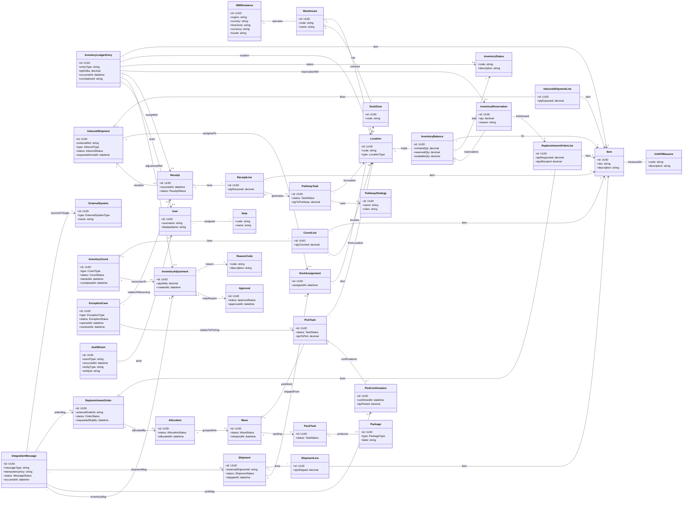

### 1.- Introduction
<!-- Create a description of the document -->

### 2.- Context diagram
This diagram shows the system-in-context for a **single `WMSInstance`** (warehouse-scoped deployment) and its primary external interactions. The key architectural intent for Iteration 1 is to establish **instance isolation** (each warehouse instance operates independently) and **decoupled integrations** (stable APIs and/or event streams) so external systems can evolve without changing core WMS domain logic.

### 3.- Architectural drivers
This section summarizes the drivers relevant to the ADD iterations captured in this document.

#### Iteration drivers summary

| Iteration | Goal focus | Drivers |
|---:|---|---|
| 1 | Initial structuring of a single `WMSInstance` and its integration boundaries | **Quality**: QA-06, QA-08. **Constraints**: C-01..C-07. **Concerns**: AC-02, AC-04 |
| 2 | Foundation for inventory correctness (balances, statuses, reservations) | **Quality**: QA-04, QA-05. **User stories**: US-01, US-02, US-15. **Concerns**: AC-05 |
| 3 | High-throughput replenishment order intake and planning | **Quality**: QA-01, QA-04. **User stories**: US-03, US-04. **Concerns**: AC-01, AC-02 |
| 4 | Picking execution and automation integration | **Quality**: QA-04, QA-05, QA-06. **User stories**: US-05, US-06, US-07. **Constraints**: C-06. **Concerns**: AC-03 |

#### Quality attribute scenarios

| ID | Quality Attribute | Scenario summary |
| :---- | :---- | :---- |
| QA-06 | Integration | Integrations are decoupled via stable APIs and/or event streams so new systems or instances can be added without changing core WMS code. |
| QA-08 | Tenant isolation | Issues in one WMS instance must not impact other instances. |
| QA-04 | Reliability / Data integrity | Inventory-affecting actions must be processed exactly once or idempotently under retries/failures so inventory and financial data remain consistent. |
| QA-05 | Performance | Interactive inventory searches and work-queue queries must load within 1 second for 95% of requests. |

#### Constraints

| ID | Constraint |
| :---- | :---- |
| C-01 | Public cloud deployment using managed services where feasible. |
| C-02 | Multi-country compliance and full i18n/l10n (locale, currency, time zone). |
| C-03 | Independent WMS instances with possible shared services such as monitoring and identity. |
| C-04 | Integrate with store systems using standard protocols. |
| C-05 | Integrate with corporate financial system using agreed integration patterns and data contracts. |
| C-06 | Integrate with warehouse automation via resilient APIs or connectors tolerant of intermittent connectivity. |
| C-07 | Comply with corporate security and data protection policies, encryption and RBAC. |

#### Architectural concerns

| ID | Concern |
| :---- | :---- |
| AC-02 | Partition the system into modules/services to allow independent evolution while keeping complexity manageable. |
| AC-04 | Support multiple instances in the cloud with strong isolation and operational simplicity. |
| AC-05 | Ensure consistent inventory and shipment data across WMS and external systems in the presence of asynchronous messaging and failures. |

### 4.- Domain model
The following domain model represents the **core business concepts inside a single WMS instance** (i.e., one warehouse-scoped or regional deployment with independent data and lifecycle). It focuses on the objects required to support inbound, inventory, outbound fulfillment, counting/reconciliation, and traceability, as described in `Requirements/ArchitecturalDrivers.md`.

| Element | Description |
|---|---|
| `WMSInstance` | Logical deployment boundary for a single warehouse-scoped or regional WMS instance with **independent data and lifecycle**. Holds localization parameters (country, locale, currency, time zone) to support multi-country operation. |
| `Warehouse` | Physical warehouse operated by a `WMSInstance`. Owns operational layout (locations, dock doors) and is the unit of operational reporting and configuration. |
| `Location` | A typed storage/processing area (e.g., reserve, pick face, staging, receiving). Used as the anchor for inventory holding, put-away destinations, and pick sources. |
| `DockDoor` | Physical dock door used to stage inbound/outbound movements. Supports congestion control via assignments. |
| `DockAssignment` | Assignment of an inbound or outbound flow to a specific `DockDoor` at a time, supporting US-14. |
| `Item` | SKU master data required to receive, store, pick, pack, ship, count, and reconcile inventory. |
| `UnitOfMeasure` | Defines measurement units and conversions used for receiving, picking, and shipping quantities (supports US-13 configuration). |
| `InventoryStatus` | Business status of inventory (available, reserved, damaged, quarantined). Drives allocation eligibility and compliance (US-15, US-19). |
| `InventoryBalance` | Current-state view of inventory for an `Item` at a `Location` with a given `InventoryStatus`. Optimized for fast “what do we have, where” queries (QA-05). It is maintained as a projection of inventory postings. |
| `InventoryLedgerEntry` | Append-only record of an inventory-affecting posting (receipt, reservation, release, status transfer, adjustment). Supports auditability, reconciliation, and safe replay/verification (QA-04, AC-05). |
| `InventoryReservation` | A first-class reservation of inventory (often against `ReplenishmentOrderLine`) to prevent double-allocation and support idempotent processing under retries (QA-04). |
| `InboundShipment` | Represents an inbound flow (supplier delivery or return). Tracks lifecycle from expected arrival to receipt completion (US-01). |
| `InboundShipmentLine` | Line-level expectation for items/quantities in an `InboundShipment`. |
| `Receipt` | The act of receiving and registering inbound goods. Can be partial and may produce exceptions. Updates `InventoryBalance` as inventory becomes on hand (US-01, QA-04). |
| `ReceiptLine` | Received quantities by item, enabling reconciliation against shipment expectations and downstream put-away generation. |
| `PutAwayTask` | Work instruction to move received goods from receiving/staging into a target `Location` (US-02). |
| `PutAwayStrategy` | Configurable rules/heuristics used to choose put-away destinations (e.g., rotation, size), supporting warehouse-specific tailoring (US-02, US-13, AC-08). |
| `ReplenishmentOrder` | Demand submitted by store systems to replenish stores. Drives outbound planning and execution (US-03). |
| `ReplenishmentOrderLine` | Item-level demand and allocated quantity, used as the binding point for reservations and shipment contents. |
| `Allocation` | Decision artifact that allocates inventory to order lines and prepares work for release into `Wave`s (US-04). |
| `Wave` | Grouping/batching of pick work for optimization and balancing (US-04). Supports progressive release and reprioritization. |
| `PickTask` | Unit of picking work issued to humans or automation. Must be integratable and idempotent when sent to picking systems (US-05, QA-04). |
| `PickConfirmation` | Confirmation of picked quantity (manual or from automation). Updates inventory and downstream packing/shipping state (US-07). |
| `PackTask` | Work to pack picked items into handling units for shipment (US-08). |
| `Package` | A carton/pallet (handling unit) produced during packing; supports content tracking communicated to stores (US-09). |
| `Shipment` | Outbound shipment entity used to confirm shipping, communicate contents, and trigger financial events (US-08, US-09, US-10). |
| `ShipmentLine` | Item-level shipped quantities used for store updates and invoicing-relevant data. |
| `InventoryCount` | Cycle count or full physical count activity (US-11). Drives reconciliation and adjustment workflows. |
| `CountLine` | Counted quantity per item (and optionally location), enabling discrepancy calculation. |
| `InventoryAdjustment` | Inventory delta created by reconciliation. Must be auditable and may require approval and reason codes (US-11, US-18). |
| `ReasonCode` | Controlled vocabulary explaining adjustments and exceptions for compliance and reporting (US-11, US-18). |
| `Approval` | Approval workflow state for sensitive adjustments, supporting governance and auditability (US-11, US-18). |
| `ExceptionCase` | Captures and tracks operational exceptions in receiving and picking (US-06), preventing inventory corruption and enabling resolution workflows. |
| `AuditEvent` | Immutable trace of inventory-affecting actions with actor/entity references to meet audit requirements (US-18) and support forensic troubleshooting (QA-09). |
| `User` | Human user identity inside a WMS instance context. Role assignment enables RBAC (US-13, QA-07). |
| `Role` | Role definitions used for authorization by role and warehouse (QA-07). |
| `ExternalSystem` | Represents integrated systems (store systems, financial system, picking systems) to support decoupled integrations (QA-06). |
| `IntegrationMessage` | Records integration exchanges with idempotency key and status to support **exactly-once or idempotent processing** and operational visibility (QA-04, QA-09). |

#### Inventory invariants and reservation lifecycle (Iteration 2)
- **Inventory invariants**: `availableQty = onHandQty - reservedQty` and all quantities are non-negative per `Item` + `Location` + `InventoryStatus`.
- **Reservation lifecycle**: reservations move through explicit states to support idempotency, partial processing, and safe release.

### 5.- Container diagram
This container view refines the **single `WMSInstance`** into deployable building blocks. It reflects the Iteration 1 strategy: **cell-based isolation per instance**, a **modular core** for the domain, and an **integration boundary** that supports decoupled APIs and event streams.

| Container | Responsibilities |
|---|---|
| `API gateway` | Stable entry point; routes traffic to the correct `WMSInstance` deployment; enforces TLS, authentication integration, and coarse rate limits. |
| `WMS core application` | Modular monolith containing the core WMS domain and workflows for inbound, inventory, outbound, counting, tasking, configuration, and audit. Owns the source of truth for warehouse operational data. |
| `Integration gateway` | Anti-corruption layer for store, financial, and automation systems; protocol adaptation; contract versioning; idempotency enforcement; transforms external messages into internal commands/events. |
| `Event bus` | Managed pub/sub fabric for decoupled integrations; enables event-driven fan-out and asynchronous processing per instance. |
| `WMS operational database` | Primary per-instance datastore for core operational entities, configuration, and audit trails. |
| `Idempotency and dedup store` | Stores idempotency keys and processing outcomes for external requests/messages to prevent duplicate effects under retries/failures. |
| `Outbox publisher` | Transactional outbox publisher that reliably emits integration events from committed database changes to the event bus. |
| `Identity provider` | Centralized identity service used by all instances; provides authentication tokens and identity lifecycle. |
| `Central observability` | Centralized logs/metrics/traces collection with strict per-instance partitioning for supportability. |

### 6.- Component diagrams
The following component view refines the `WMS core application` into **bounded modules**. These are logical components intended to minimize coupling and enable future extraction if needed.

| Component | Responsibilities |
|---|---|
| `Inbound module` | Inbound shipment and receiving lifecycle; receipts; put-away task creation; exception capture for inbound. |
| `Inventory module` | Inventory balances, statuses, reservations, adjustments, and inventory-affecting invariants. |
| `Outbound module` | Replenishment orders and their lifecycle; order intake validation and normalization; allocation and wave planning; planning work partitioning; shipment lifecycle and contents. |
| `Tasking module` | Work orchestration for put-away, picking, packing tasks; work queue queries; task assignment scaffolding. |
| `Configuration module` | Warehouse-specific configuration such as locations, units of measure, strategies, and integrations configuration. |
| `Audit and traceability module` | Immutable audit events for inventory-affecting actions and integration processing trace. |
| `Authorization module` | Role-based authorization checks scoped to warehouse instance and roles. |
| `Outbox and event publication module` | Transactional outbox writes and publication coordination for domain and integration events. |

### 7.- Sequence diagrams
The sequence diagrams below illustrate the key interactions across iterations. Iteration 1 focuses on **decoupled integration** (QA-06) and **per-instance isolation boundaries** (QA-08). Iteration 2 refines the **inventory correctness** foundation (QA-04, AC-05) while maintaining fast operational reads (QA-05).

#### Sequence 1: Store submits replenishment order
This sequence shows a store system submitting an order through a stable API with idempotency. The integration gateway translates the request into an internal command, commits it, and emits an event via the outbox.

#### Sequence 2: Automation confirms picks
This sequence shows an automation system confirming picks with **inbox-first durability** and idempotency to avoid duplicate inventory updates under retries and intermittent connectivity.

#### Sequence 3: Shipment confirmation triggers downstream notifications
This sequence shows shipment confirmation being committed once and producing downstream events for store and financial integrations.

#### Sequence 4: Receiving posts inventory with auditable ledger entry (Iteration 2)
This sequence shows receiving as a single inventory-affecting transaction: the receipt is persisted together with an `InventoryLedgerEntry`, the `InventoryBalance` projection is updated, and an `AuditEvent` is recorded.

#### Sequence 5: Create reservation to prevent double allocation (Iteration 2)
This sequence shows an internal reservation created against demand. The inventory module enforces invariants and records a ledger entry so retries are safe and auditable.

#### Sequence 6: Inventory status transfer (available to quarantined) (Iteration 2)
This sequence shows a status change as a posting that preserves auditability and inventory correctness.

#### Sequence 7: Async order intake with durable acceptance and planning trigger (Iteration 3)
This sequence refines replenishment order intake to support peak throughput by durably accepting requests (idempotent) and triggering downstream planning asynchronously via the outbox and event bus.

#### Sequence 8: Allocation and wave planning with reservation-based correctness (Iteration 3)
This sequence shows planning consuming a planning job, allocating inventory by committing reservations (inventory invariants), building a wave, and generating pick tasks while emitting durable events via the outbox.

#### Sequence 9: Distribute pick tasks to automation with store and forward (Iteration 4)
This sequence shows pick task distribution using a store-and-forward connector in the integration boundary so intermittent automation connectivity does not block warehouse execution.

#### Sequence 10: Manual picker confirms picks (Iteration 4)
This sequence shows a picker confirming picks via the WMS UI/API, with inventory postings handled at the inventory boundary for correctness and auditability.

#### Sequence 11: Register and resolve a picking exception (Iteration 4)
This sequence shows a supervisor capturing a picking exception and resolving it with controlled, auditable actions so operations continue without corrupting inventory.

### 8.- Interfaces
This section lists the primary interface shapes established in Iteration 1. Detailed contracts and schemas will be refined in later iterations.

| Interface | Type | Notes |
|---|---|---|
| Store integration API | REST | Versioned endpoints for replenishment orders and shipment confirmations; idempotency keys required; order intake is durably accepted (202) and planned asynchronously in Iteration 3. |
| Automation integration API | REST | Versioned endpoints for pick task distribution and pick confirmations; supports intermittent connectivity via retries and idempotency; requires correlation identifiers (`pickTaskId`, `correlationId`) and idempotency keys for confirmations and task delivery acknowledgements. |
| Financial integration | Events and REST | Primary path is event-driven with stable contracts; synchronous calls may be used for validation or acknowledgements per corporate patterns. |
| Instance routing | HTTP | Each request is routed to a specific `WMSInstance` deployment using an instance identifier and authorization scope. |
| Inventory operational API | REST | Inventory queries and inventory-affecting commands (receive, reserve, release, status change, adjust). Inventory-affecting commands must be idempotent (QA-04). |

### 9.- Design decisions
The following design decisions were made during the ADD iterations to satisfy the selected drivers.

|Driver|Decision|Rationale|Discarded alternatives|
|---|---|---|---|
|AC-04, QA-08, C-03|Adopt a **cell-based instance model** where each `WMSInstance` is an isolated deployment unit with its own primary datastore and eventing resources; requests are routed to the correct instance at the edge.|Strong fault and performance isolation reduces blast radius and prevents noisy-neighbor effects; enables independent lifecycle management per warehouse instance while still allowing selective shared platform services.|Shared multi-tenant runtime and shared database with tenant partitioning (lower baseline cost but weaker isolation and higher operational and data-leakage risk).|
|AC-02|Implement the core WMS as a **modular monolith** for Iteration 1, with bounded modules for inbound, inventory, outbound, tasking, configuration, audit, and authorization.|Establishes clear internal boundaries without premature distributed-systems complexity; supports a walking skeleton quickly while keeping the design evolvable.|Microservices from day one (better independent scaling but significantly higher complexity, latency, and operational burden early).|
|QA-06, C-04, C-05, C-06|Introduce an **Integration gateway** as an anti-corruption layer for store, financial, and automation systems; centralize protocol adaptation and contract versioning outside the domain core.|Decouples external system variability from the core domain; supports adding new systems or changing protocols without changing core modules; improves maintainability and reduces integration-induced coupling.|Embedding adapters and protocol logic directly inside domain modules (faster initially but brittle and hard to evolve across many integrations).|
|QA-06, C-01|Use a **managed event bus** for asynchronous integration flows and fan-out, complemented by synchronous REST APIs where needed.|Enables stable event streams and loose coupling; supports asynchronous workflows and future extensibility while leveraging managed services to reduce ops burden.|Purely synchronous point-to-point REST for all integrations (tighter coupling and lower resilience to spikes and downtime).|
|QA-06|Adopt **transactional outbox** in the per-instance database with an **outbox publisher** to publish events to the event bus.|Avoids dual-write inconsistencies; ensures events correspond to committed state changes; provides a reliable foundation for decoupled integration messaging.|Direct publish to the event bus inside request processing without outbox (risk of lost or duplicated events under failures).|
|C-06, QA-06|Enforce **idempotency and deduplication** at the integration boundary using idempotency keys and a dedup store per instance.|Warehouse and automation connectivity can be intermittent; idempotency prevents duplicate effects under retries and supports safe replays of integration calls/messages.|Best-effort retries without idempotency (risk of duplicate downstream effects and operational instability).|
|C-07, QA-08|Centralize authentication via a shared **identity provider** while keeping authorization checks **instance-scoped** in the core and integration gateway.|Balances operational simplicity with strict instance isolation: authentication is shared, but access decisions remain bounded by warehouse instance context.|Separate identity per instance (maximum isolation but high operational overhead and inconsistent user experience).|
|C-03|Centralize observability in a shared platform with **strict per-instance partitioning** for logs, metrics, and traces.|Supports fleet operations and troubleshooting at scale while respecting instance isolation requirements.|Per-instance observability stacks (strong isolation but higher cost and fragmented operations).|
|QA-04, AC-05, US-01, US-02|Adopt an **append-only inventory ledger** (`InventoryLedgerEntry`) as the source of audit truth for all inventory-affecting postings, with `InventoryBalance` maintained as a current-state projection for operational reads.|Provides a consistent, auditable trail for inventory changes and enables verification/replay to detect and correct inconsistencies (**QA-04**, **AC-05**) while preserving fast interactive queries (**QA-05**).|Only persisting mutable `InventoryBalance` rows (simpler but weak auditability and harder to reconcile inconsistencies after failures).|
|QA-04, AC-05, US-15|Make **inventory invariants explicit** at the inventory boundary (e.g., `availableQty = onHandQty - reservedQty`, non-negative quantities per `Item` + `Location` + `InventoryStatus`) and enforce them as part of inventory postings.|Reduces risk of double allocation and inconsistent availability calculations; concentrates correctness rules where inventory changes occur (**QA-04**) and supports cross-system consistency reasoning (**AC-05**).|Embedding availability/reservation logic across multiple modules (higher inconsistency risk and harder auditability).|
|QA-04, AC-05, US-15|Model `InventoryReservation` as a **first-class state machine** (Pending → Committed → Consumed/Released/Expired) and record reservation postings in the ledger.|Supports idempotent retries, partial processing, and safe release/expiry semantics; provides traceability for reservation-driven availability changes (**QA-04**, **AC-05**).|Implicit reservations by decrementing `availableQty` only (harder to audit, brittle under retries/partials).|
|QA-04, QA-05|Require **idempotency for inventory-affecting commands** on the `Inventory operational API` (receipt posting, reserve/release, status change, adjustment), with outcomes recorded for safe retries.|Prevents duplicate effects under intermittent connectivity and retries (**QA-04**) while enabling predictable client behavior and operational recovery without manual reconciliation; keeps interactive flows responsive by avoiding heavyweight locking (**QA-05**).|Best-effort retries without idempotency (duplicate postings and inventory corruption risk).|
|QA-01, AC-01, US-03|Adopt an **async order intake** model: durably accept replenishment orders (202) after persistence, then trigger downstream planning asynchronously via outbox/event bus.|Decouples peak API traffic from planning compute to sustain **10,000 orders/hour** without downtime (**QA-01**), while preserving durability and recoverability of accepted demand.|Synchronous “submit and allocate” in the API path (higher tail latency and overload risk at peak).|
|QA-01, AC-02, US-04|Partition outbound planning into **Order Intake** (validation/normalization) and **Planning** (allocation/wave building) responsibilities within the `Outbound module` and execute planning via horizontally-scalable workers.|Improves modularity and scalability at the hotspot without introducing distributed-service complexity; planning throughput can scale independently from ingestion, supporting **QA-01** and keeping boundaries manageable (**AC-02**).|Single monolithic outbound workflow component for both ingestion and planning (harder to scale and evolve).|
|QA-04, US-04|Make **reservation-based allocation** the correctness boundary during planning: allocation commits `InventoryReservation` and related ledger/balance updates atomically with allocation artifacts.|Prevents double allocation under concurrent planning/retries; leverages inventory invariants and auditability foundation from Iteration 2 to preserve **QA-04** during high-throughput allocation.|Allocating by directly decrementing availability in outbound tables without inventory postings (inconsistent source of truth and weaker auditability).|
|QA-04, QA-01, US-04|Emit `allocation created` and `wave released` as **transactional outbox events** tied to committed planning state.|Ensures downstream systems and workers see only committed planning outcomes (**QA-04**) while enabling asynchronous fan-out and scaling (**QA-01**).|Direct bus publish inside planning transaction without outbox (risk of lost/duplicated events).|
|QA-04, QA-06, C-06, AC-03, US-05|Adopt a **store-and-forward automation connector** at the integration boundary: persist outbound pick task messages and manage delivery with retries/backoff and acknowledgements.|Tolerates intermittent warehouse automation connectivity (**C-06**) while keeping integrations decoupled (**QA-06**) and preventing lost/duplicated task dispatch effects under retries (**QA-04**); isolates protocol/vendor variability (**AC-03**).|Pure synchronous “push tasks” from core to automation (tight coupling, fragile under connectivity issues); direct point-to-point calls without durable send state (hard to recover).|
|QA-04, QA-06, AC-03, US-07|Require **idempotent pick confirmations** from automation (and manual confirmation APIs) using idempotency keys and recorded outcomes, with stable correlation identifiers (`pickTaskId`, `correlationId`).|Prevents duplicate inventory postings and duplicated confirmations under retries (**QA-04**); improves reconciliation and traceability across systems (**QA-06**, **AC-03**).|Attempting exactly-once delivery “over the wire” (unrealistic); best-effort retries without dedup (inventory corruption risk).|
|QA-04, AC-05, US-07|Handle pick confirmations by **posting through the Inventory module boundary** (consume reservations, append `InventoryLedgerEntry`, update `InventoryBalance` projection) as a single correctness boundary.|Reuses the inventory correctness foundation to ensure picks consistently affect inventory with auditability and replayability (**QA-04**, **AC-05**), regardless of source (automation or manual).|Updating inventory directly in tasking/integration code paths (leaks invariants and increases inconsistency risk).|
|US-06, QA-04|Treat picking exceptions as **first-class workflow** (`ExceptionCase`) with controlled resolution actions and audit events, tied to `PickTask` state transitions.|Keeps operations running while preventing ad-hoc inventory changes; provides auditable, supervised resolution that preserves correctness under disruptions (**US-06**, **QA-04**).|Manual out-of-band fixes and spreadsheet reconciliation (fast locally but high integrity/compliance risk); burying exceptions in logs only (poor operational control).|
