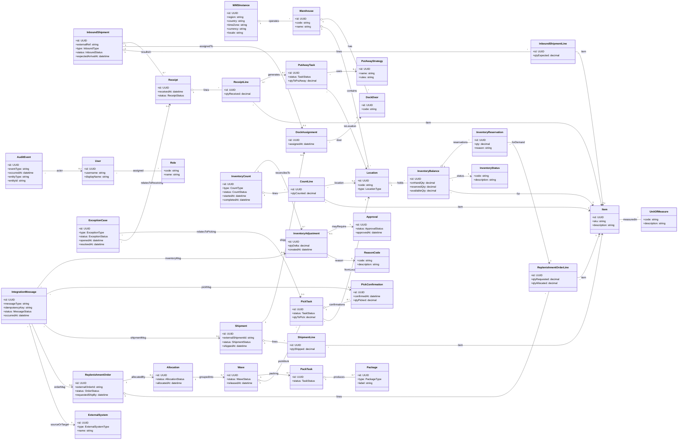

### 1.- Introduction
<!-- Create a description of the document -->

### 2.- Context diagram
<!-- Include the context diagram from the [FILE:ArchitecturalDrivers.md] document, if available. Include a paragraph at the beginning that describes what this diagram shows. -->

### 3.- Architectural drivers
<!-- Include a summary of the drivers described in [FILE:ArchitecturalDrivers.md], including their priorities. You should separate user stories, quality attribute scenarios, concerns and constraints in separate tables. -->

### 4.- Domain model
The following domain model represents the **core business concepts inside a single WMS instance** (i.e., one warehouse-scoped or regional deployment with independent data and lifecycle). It focuses on the objects required to support inbound, inventory, outbound fulfillment, counting/reconciliation, and traceability, as described in `Requirements/ArchitecturalDrivers.md`.

| Element | Description |
|---|---|
| `WMSInstance` | Logical deployment boundary for a single warehouse-scoped or regional WMS instance with **independent data and lifecycle**. Holds localization parameters (country, locale, currency, time zone) to support multi-country operation. |
| `Warehouse` | Physical warehouse operated by a `WMSInstance`. Owns operational layout (locations, dock doors) and is the unit of operational reporting and configuration. |
| `Location` | A typed storage/processing area (e.g., reserve, pick face, staging, receiving). Used as the anchor for inventory holding, put-away destinations, and pick sources. |
| `DockDoor` | Physical dock door used to stage inbound/outbound movements. Supports congestion control via assignments. |
| `DockAssignment` | Assignment of an inbound or outbound flow to a specific `DockDoor` at a time, supporting US-14. |
| `Item` | SKU master data required to receive, store, pick, pack, ship, count, and reconcile inventory. |
| `UnitOfMeasure` | Defines measurement units and conversions used for receiving, picking, and shipping quantities (supports US-13 configuration). |
| `InventoryStatus` | Business status of inventory (available, reserved, damaged, quarantined). Drives allocation eligibility and compliance (US-15, US-19). |
| `InventoryBalance` | On-hand view of inventory for an `Item` at a `Location` with a given `InventoryStatus`. Supports fast “what do we have, where” queries (QA-05) and is the foundation for allocation and reconciliation. |
| `InventoryReservation` | A reservation of inventory (often against `ReplenishmentOrderLine`) to prevent double-allocation and support idempotent processing (QA-04). |
| `InboundShipment` | Represents an inbound flow (supplier delivery or return). Tracks lifecycle from expected arrival to receipt completion (US-01). |
| `InboundShipmentLine` | Line-level expectation for items/quantities in an `InboundShipment`. |
| `Receipt` | The act of receiving and registering inbound goods. Can be partial and may produce exceptions. Updates `InventoryBalance` as inventory becomes on hand (US-01, QA-04). |
| `ReceiptLine` | Received quantities by item, enabling reconciliation against shipment expectations and downstream put-away generation. |
| `PutAwayTask` | Work instruction to move received goods from receiving/staging into a target `Location` (US-02). |
| `PutAwayStrategy` | Configurable rules/heuristics used to choose put-away destinations (e.g., rotation, size), supporting warehouse-specific tailoring (US-02, US-13, AC-08). |
| `ReplenishmentOrder` | Demand submitted by store systems to replenish stores. Drives outbound planning and execution (US-03). |
| `ReplenishmentOrderLine` | Item-level demand and allocated quantity, used as the binding point for reservations and shipment contents. |
| `Allocation` | Decision artifact that allocates inventory to order lines and prepares work for release into `Wave`s (US-04). |
| `Wave` | Grouping/batching of pick work for optimization and balancing (US-04). Supports progressive release and reprioritization. |
| `PickTask` | Unit of picking work issued to humans or automation. Must be integratable and idempotent when sent to picking systems (US-05, QA-04). |
| `PickConfirmation` | Confirmation of picked quantity (manual or from automation). Updates inventory and downstream packing/shipping state (US-07). |
| `PackTask` | Work to pack picked items into handling units for shipment (US-08). |
| `Package` | A carton/pallet (handling unit) produced during packing; supports content tracking communicated to stores (US-09). |
| `Shipment` | Outbound shipment entity used to confirm shipping, communicate contents, and trigger financial events (US-08, US-09, US-10). |
| `ShipmentLine` | Item-level shipped quantities used for store updates and invoicing-relevant data. |
| `InventoryCount` | Cycle count or full physical count activity (US-11). Drives reconciliation and adjustment workflows. |
| `CountLine` | Counted quantity per item (and optionally location), enabling discrepancy calculation. |
| `InventoryAdjustment` | Inventory delta created by reconciliation. Must be auditable and may require approval and reason codes (US-11, US-18). |
| `ReasonCode` | Controlled vocabulary explaining adjustments and exceptions for compliance and reporting (US-11, US-18). |
| `Approval` | Approval workflow state for sensitive adjustments, supporting governance and auditability (US-11, US-18). |
| `ExceptionCase` | Captures and tracks operational exceptions in receiving and picking (US-06), preventing inventory corruption and enabling resolution workflows. |
| `AuditEvent` | Immutable trace of inventory-affecting actions with actor/entity references to meet audit requirements (US-18) and support forensic troubleshooting (QA-09). |
| `User` | Human user identity inside a WMS instance context. Role assignment enables RBAC (US-13, QA-07). |
| `Role` | Role definitions used for authorization by role and warehouse (QA-07). |
| `ExternalSystem` | Represents integrated systems (store systems, financial system, picking systems) to support decoupled integrations (QA-06). |
| `IntegrationMessage` | Records integration exchanges with idempotency key and status to support **exactly-once or idempotent processing** and operational visibility (QA-04, QA-09). |

### 5.- Container diagram
<!-- This section contains the main container diagram, according to the C4 approach. This section should also include a table with the name of the container and its responsibilities. -->

### 6.- Component diagrams
<!-- Component diagrams thar correspond to the containers go here, Each component diagram should have an associated table with the name of the components and their responsibilities. -->

### 7.- Sequence diagrams
<!-- For each functional requirement or quality attribute, a sequence diagram will be included here. Below each sequence diagram, there should be a description of what the diagram represents -->

### 8.- Interfaces
<!-- This section will include details about contracts- -->

### 9.- Design decisions
<!-- This section describes the relevant design decisions that resulted in this design. -->
